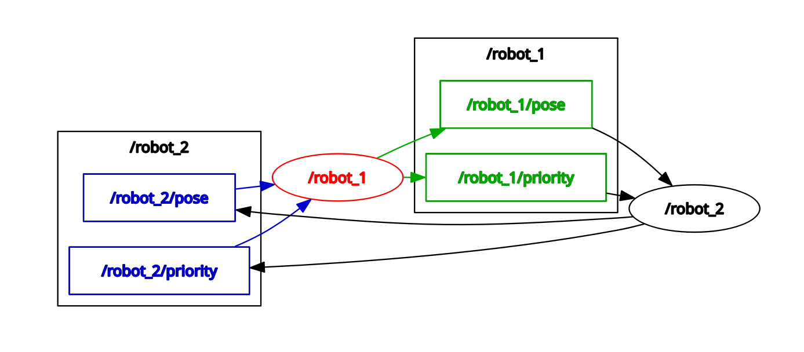
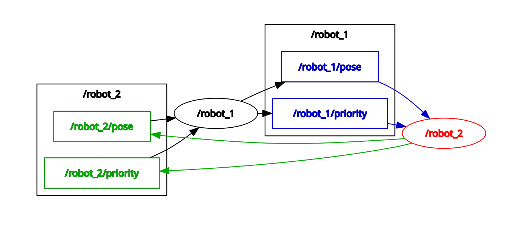

## Synchronization between Position & Priority

I did this by defining a dictionary called fleet_view and attaching it to the Robot Node, this would be the saved data of every other robot in the node, with their robot_ids and keys and RobotStates as values, and whenever a callback of either position/priority topic is triggered, it writes to the individual robot_id key, and changes the RobotState within to the new values.

### RQT Graphs

